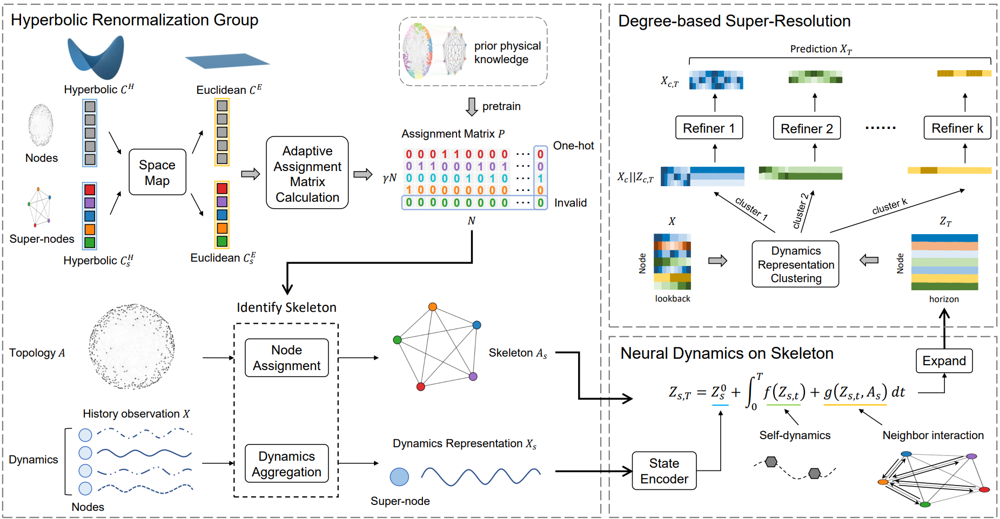

# DiskNet

The repo is the official implementation for our  paper: "Predicting Long-term Dynamics of Complex Networks via Identifying Skeleton in Hyperbolic Space” (KDD 2024). 


## Overall Architecture

DiskNet: (1) Hyperbolic Renormalization Group, which identifies the representation and skeleton of network dynamics; (2) Neural Dynamics on Skeleton, which models the dynamics of super-nodes on the skeleton; and (3) Degree-based Super-Resolution, which lifts the predicted values of super-nodes to the original nodes.




## Environment Setup

```
conda create --name <env> --file requirement.txt
```


## Usage

**Config:**

graph_type: `BA `, `WS`, `Drosophila`, `Social`, `Web`, `PowerGrid` or `Airport`;

dynamics: `HindmarshRose`, `FitzHughNagumo` or `CoupledRossler`

**Run:**

```shell
python main.py
```


## Citation

If you find this repo helpful, please cite our paper.

```
@inproceedings{li2024predicting,
  title={Predicting Long-term Dynamics of Complex Networks via Identifying Skeleton in Hyperbolic Space},
  author={Li, Ruikun and Wang, Huandong and Piao, Jinghua and Liao, Qingmin and Li, Yong},
  booktitle={Proceedings of the 30th ACM SIGKDD Conference on Knowledge Discovery and Data Mining},
  pages={1655--1666},
  year={2024}
}
```
